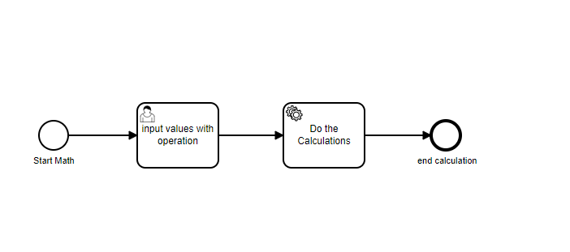

This example is a camunda form + springboot.
It is an simple example where user will enter 2 different inputs with desired Math operation needed.
Based on that the next service will do the operation.

Below camunda components are used.
1. BPMN
2. Forms
3. Spring boot with delegate expression.

